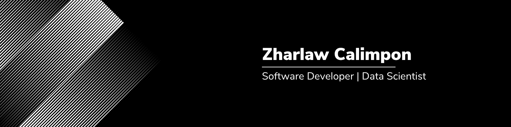

<h2 align="left">Hi there! 👋</h2>

###

  

 

Hi! I'm Zharlaw Calimpon, a Software Developer and Data Scientist from Cebu City, Philippines 🇵🇭.  
A Computer Science graduate from the University of San Jose–Recoletos, I'm passionate about building impactful applications that bridge ideas and technology.

💡 **What drives me:** I'm dedicated to continuous learning and solving real-world problems through tech!

###

  
  
  

###

<h1>Tech Stack </h1>

<h3> 🤝 Let's Connect! </h3>

I'm always excited to collaborate on innovative projects or discuss tech trends. Feel free to [reach out](mailto:zharlaw@gmail.com) or connect with me on [LinkedIn](https://www.linkedin.com/in/zharlaw-calimpon-734384209/).

###

  

